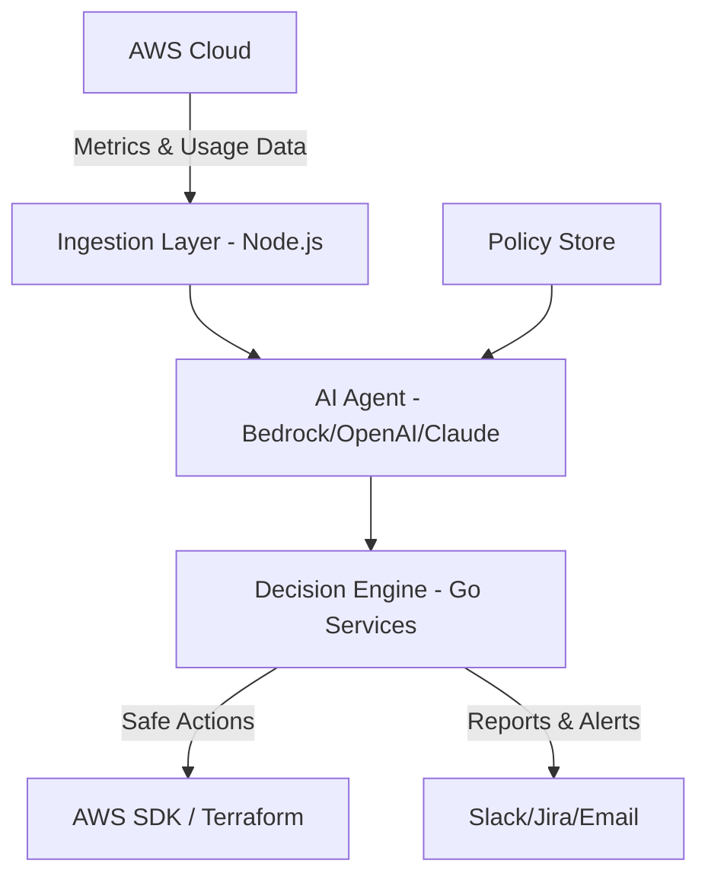

# 🌩️ AI-Powered Cloud Cost Optimizer Agent  

> 🚀 An AI-driven agent that continuously monitors AWS resources, detects underutilization, and optimizes cloud costs with **automation, intelligence, and business-aware policies**.  

---

## ✨ Why This Project?  

Cloud costs are the **second largest expense** for many companies after payroll.  
AWS provides services like **Compute Optimizer** and **Cost Explorer**, but they:  
- Only **recommend** actions (no automation).  
- Work only within AWS.  
- Don’t adapt to **business-specific policies**.  

This project is different.  
It’s not just an analyzer — it’s a **smart AI agent** that:  
- Thinks about your infrastructure like a DevOps engineer.  
- Acts when safe, recommends when risky.  
- Can be extended to **multi-cloud** environments.  

---

## 🚀 Features  

✅ Continuous monitoring of AWS resources (EC2, RDS, Lambda, S3, …).  
✅ AI-powered recommendations (e.g., “downgrade instance type”, “delete unattached volumes”).  
✅ **Auto-execution** mode with approval workflows.  
✅ Policy-aware optimization (e.g., never touch PROD on weekends).  
✅ Multi-cloud ready (AWS, GCP, Azure).  
✅ Slack/Jira integration for alerts and tickets.  
✅ Forecasting & anomaly detection using AI.  

---

## 🏗️ Architecture  



- **Ingestion Layer (Node.js)** → Collects AWS metrics & billing data.  
- **AI Agent** → Analyzes cost patterns, predicts savings.  
- **Decision Engine (Go)** → Executes safe optimizations, enforces policies.  
- **Integrations** → Slack/Jira for human-in-the-loop approvals.  

---

## ⚡ Tech Stack  

- **Languages**: Go, Node.js  
- **Cloud**: AWS (Lambda, Step Functions, DynamoDB, CloudWatch, S3)  
- **AI**: AWS Bedrock / OpenAI GPT / Claude (pluggable)  
- **Infra-as-Code**: Terraform / CDK  
- **Messaging**: Slack, Jira API  

---

## 🔧 Setup & Installation  

### 1️⃣ Clone the repository  
```bash
git clone https://github.com/ridhamz/cloud-cost-optimizer.git
cd cloud-cost-optimizer
```

### 2️⃣ Configure environment variables  
Create a `.env` file:  
```bash
AWS_REGION=us-east-1
SLACK_WEBHOOK_URL=...
OPENAI_API_KEY=...
```

### 3️⃣ Deploy backend (Go + Node.js)  
```bash
make deploy
```

### 4️⃣ Run locally for testing  
```bash
npm install
npm run dev
```

---

## 📊 Example Usage  

### Slack Bot  
```text
User: "Show me the top 5 unused resources this week"  
Agent: "I found 3 EC2 instances idle >90% and 2 unattached EBS volumes. Estimated savings: $450/month."
```

### Automated Optimization  
- Detects idle EC2 instance.  
- Cross-checks with policies.  
- Shuts it down automatically.  
- Posts a summary to Slack/Jira.  

---

## 🛡️ Security & Safety  

- 🔐 Role-based access to resources.  
- ✅ Human-in-the-loop for risky optimizations.  
- 📜 Audit logs for every AI-driven action.  

---

## 📌 Roadmap  

- [ ] Add GCP & Azure support.  
- [ ] Cost forecasting dashboards.  
- [ ] Multi-agent system (one for detection, one for execution, one for reporting).  
- [ ] Voice assistant integration.  

---

## 🤝 Contributing  

Contributions are welcome! 🎉  
- Open an issue for feature requests.  
- Submit PRs for bug fixes.  
- Share ideas for new AI use cases.  

---

## 📜 License  

MIT License © 2025 Ridha

---

## 💡 Inspiration  

This project bridges the gap between **AWS Cost Optimizer** and a real **AI-powered DevOps assistant**.  
Where AWS stops at recommendations, this agent **acts, adapts, and saves money automatically**.  
